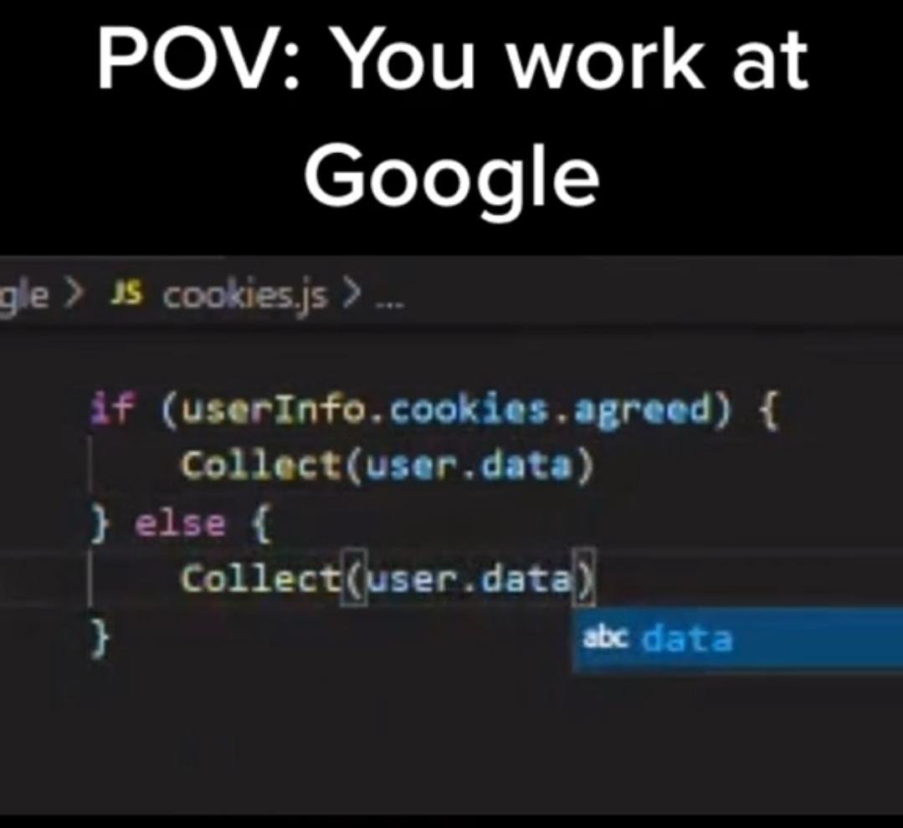
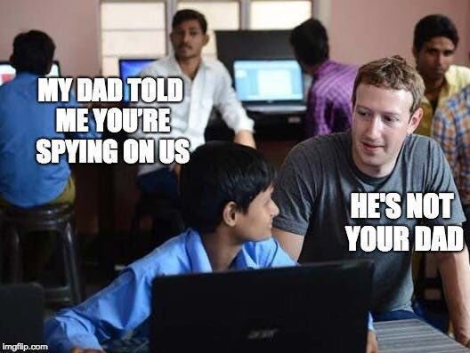
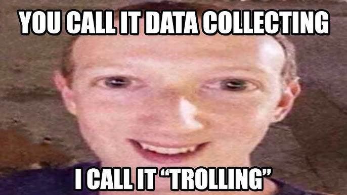
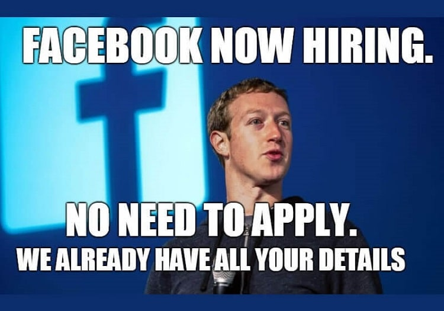

# Referat Privacy
Jakob Hofer

---

### Einführung
- Internet ist überall
- vieles gratis
- => Datensammlung
- User werden zum Produkt

---

<!-- _class: lead -->

# Daten sind wertvoll!

---

### Datenspionage - Firmen
- Trend: steigend
- 5-10% aller requests sind Tracker
- Nutzer monetarisieren
- 80% der Internetseiten haben Google-Tracker

---

### Datensammlung

- von Data Brokern zusammengefasst
- Beispiel: Werbungen auf Facebook aufgrund einer Aktion in einer anderen App

---

<!-- _class: table -->
<!-- _footer: "" -->

---

# Datenspionage - Staat

---

### China

- autokratischer Staat => Überwachung interessant
- eigene Systeme
- WeChat als Alleskönner

---

### China - WeChat

- Chat, Spiele, Bezahlungen, ...
- speichert Daten in China
- Nutzung wird analysiert und weitergegeben
- detailierte Bevölkerungsprofile

---

##### Identitätsdiebstahl

- Identität wird übernommen
- Motive:
    - Bestellen von Waren
    - Namensmiss-brauch
    - Rufschädigung

---

<!-- _class: lead -->
# Zensur & Meinungsfreiheit

---
## Zensur - Allgemein

- Informationen unterdrücken
- China und Nordkorea auf letzten Plätzen
- Thema Zensur wird zensiert

---

## Zensur - Nordkorea

- komplett abgeschottet
  - keine ausländischen Medien
- Intranet mit 28 Domains

---
## Zensur - China

- Regime blockiert alles Ungewollte
- kontrolliert gesammten Nachrichtenaustausch
- siehe WeChat

---
<!-- _class: lead -->
# Lösungen

---
### Lösungen - Internet
- AdBlocker verwenden
    - 👎 ACHTUNG: kein "Adblock Plus" usw.
    - 👍 uBlock Origin
- eigener DNS Server
    - Pi-Hole oder AdGuard Home
    - technisch limitiert
    - alternative: modden
---

### Lösungen - Browser
🤮 kein Google Chrome!
 
1. ❤ Firefox on top
    - eigene Engine
        - verhindert Monopolstellung von Google
    - am Handy: Extensions

---

### Lösungen - Browser
1. ❤ Firefox
2. 🛡 Hardened Firefox
    - eigene Engine
        - verhindert Monopolstellung von Google
    - am Handy: Extensions
---

<!-- _footer: "100% not biased trust me" -->
### Lösungen - Browser
1. ❤ Firefox
2. 🛡 Hardened Firefox
3. 😐 Brave
    - integrierter Ad- und Tracking-Blocker
        - vergleichsweise schwach
        - wird leicht erkannt
    - basiert auf Chromium
        - siehe https://tiny.cc/CommonGoogleL
        - gibt Google ungesunde Macht

---
### Lösungen - OS
- kein Windows
- kein macOS
- Linux = ❤️‍🔥
    - für paranoide: Tails, Qubes, ...
    - i use arch btw
- nein, auch kein Deepin oder RedstarOS
- am besten: TempleOS 🛕

---
# Apple....
- apple nix gut
- kein unbeschriebenes Blatt
- unerlaubtes Scannen von lokalen Dateien
- Closed Source & nonfree & unethisch
- wesentlich eingeschränkte Freiheit
- siehe https://stallman.org/apple.html

---
# Schlusswort
- Privatsphäre ist ein Grundrecht
- der Eisberg an unethischen Machenschaften ist tief
- selbst "kleine" Aktionen helfen
- selbst Balance finden zwischen Bequemlichkeit und Freiheit
- Macht und Abhängigkeit ist schädlich!!!
    - siehe Microsoft, Google, etc.

---
<!-- _footer: "" -->
<!-- _paginate: false -->
<!-- _class: smol-list -->

> Der Feind hört immer mit.

~ ich

### Quellen
- https://www.ghostery.com/blog/tracking-the-trackers-2020
- https://www.verivox.de/rechtsschutzversicherung/themen/identitaetsdiebstahl/
- https://www.reporter-ohne-grenzen.de/china
- https://www.reporter-ohne-grenzen.de/nordkorea
- https://www.ionos.de/digitalguide/domains/domainverwaltung/internet-im-kleinformat-nordkoreas-28-domains/
- https://github.com/mandatoryprogrammer/NorthKoreaDNSLeak
- https://weixin.qq.com/cgi-bin/readtemplate?lang=en_US&t=weixin_agreement&s=default&cc=CN
- https://en.wikipedia.org/wiki/WeChat#cite_note-17
- https://qz.com/960948/what-happens-when-you-try-to-send-politically-sensitive-messages-on-wechat
- https://youtu.be/_YQEE9Jl7fs?feature=shared&t=351

https://github.com/SIMULATAN/2324_MEDTSM_ReferatPrivacy
